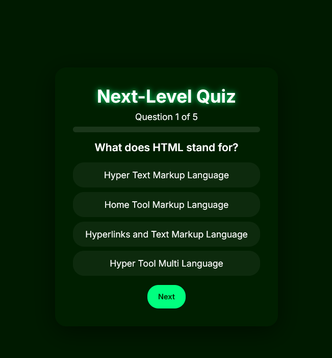

# 🧠 Quiz App

A simple and interactive **Quiz App** that allows users to test their knowledge by answering multiple-choice questions. The app provides instant feedback and shows the final score after completing the quiz. This project is built using **HTML, CSS, and JavaScript** and demonstrates core front-end development concepts.

---

🔗 **Live Demo:** [Click Here](https://devbyfahad.github.io/Quiz-app/)

---

## 📌 Features

* ❓ Multiple-choice quiz questions
* ⚡ Instant answer feedback
* 🧮 Final score calculation
* 📱 Responsive design
* 🎯 Clean and user-friendly interface
* 🚀 Built with vanilla JavaScript

---

## 🛠 Technologies Used

* HTML
* CSS
* JavaScript

---

## 🚀 How to Run the Project

1. Clone the repository

```
git clone https://github.com/DevByFahad/quiz-app.git
```

2. Navigate to the project folder

```
cd quiz-app
```

3. Open the `index.html` file in your browser.

---

## 📂 Project Structure

```
quiz-app
│
├── index.html
├── style.css
├── script.js
└── README.md
```

---

## 🎯 Purpose of the Project

This project was created to practice and demonstrate fundamental web development concepts such as:

* JavaScript DOM manipulation
* Event handling
* Creating interactive applications
* Managing quiz logic and scoring

---

## 👨‍💻 Author

**Muhammad Fahad**

---

## ⭐ Show Your Support

If you like this project, consider giving it a **star** on GitHub!

---

## 📸 Quiz App

Here’s what it looks like 👇


